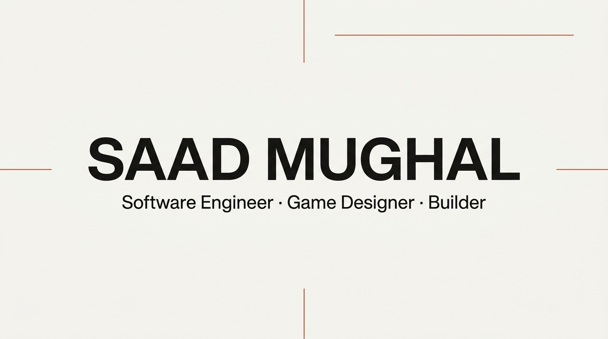
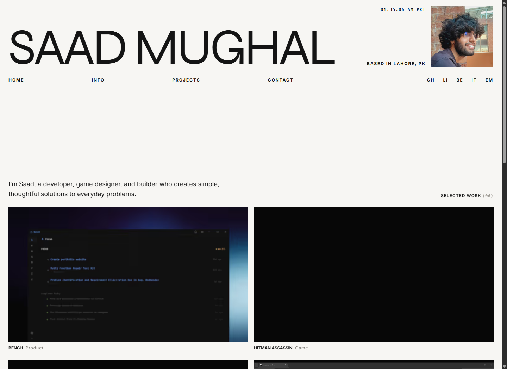
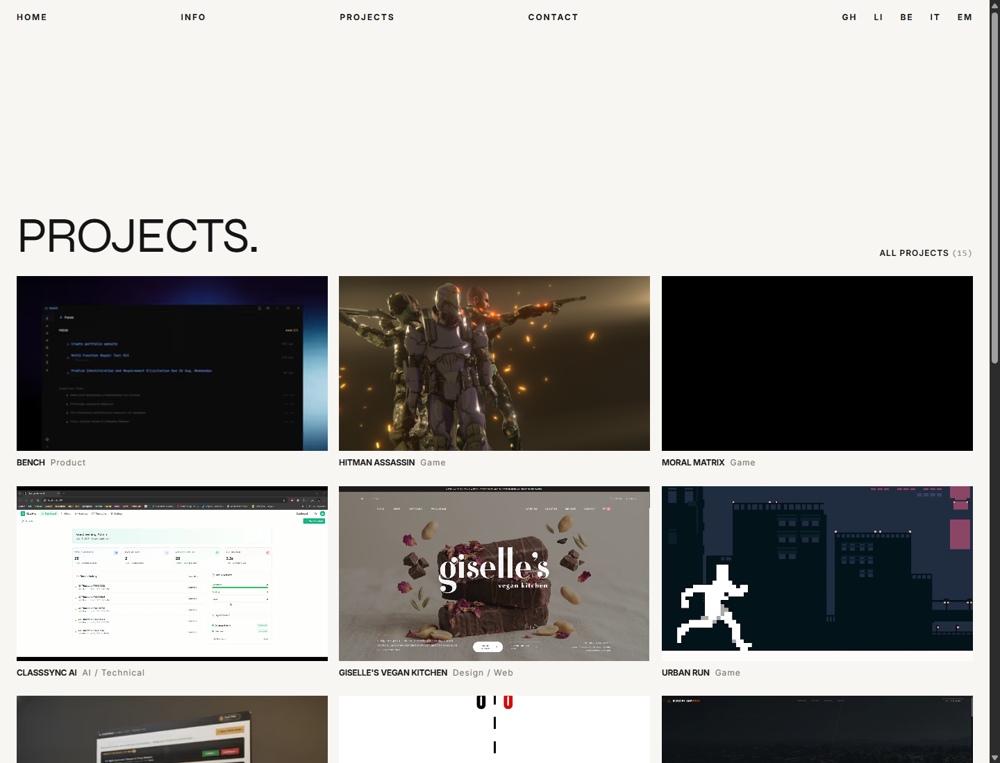
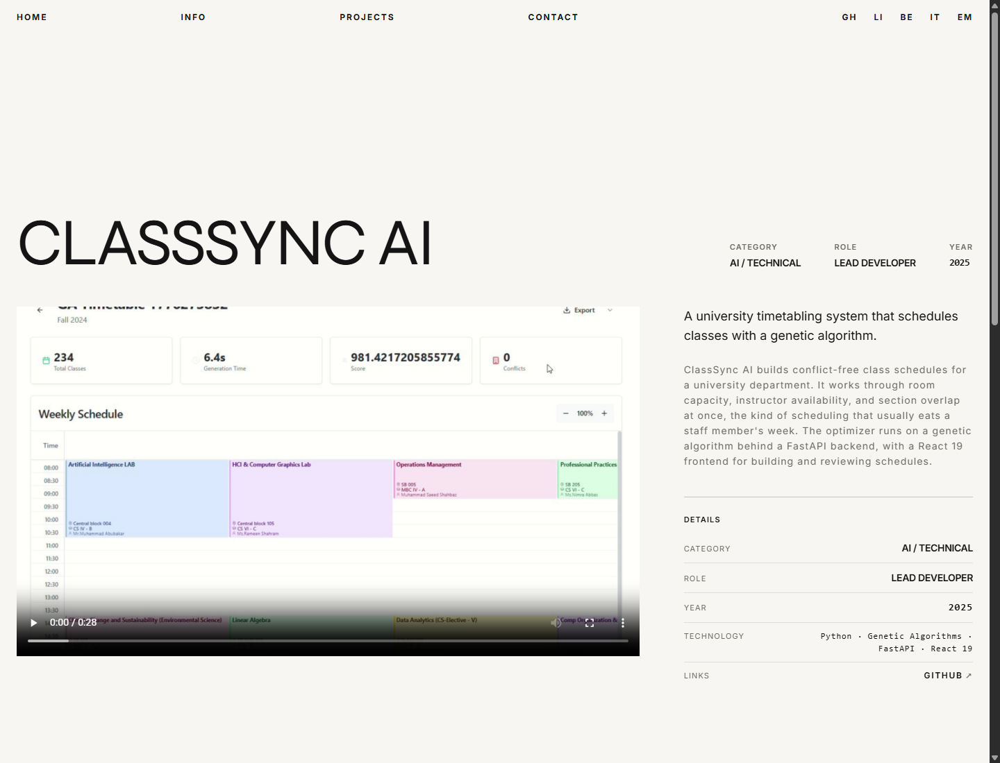
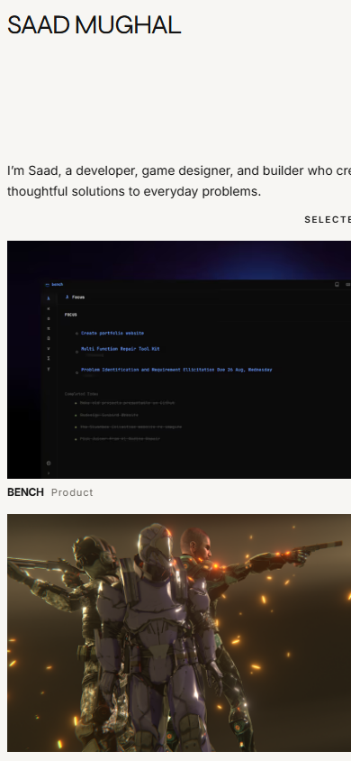
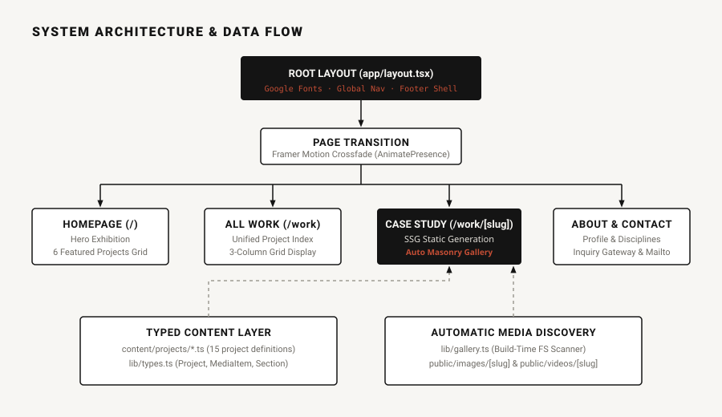

<div align="center">



# Saad Mughal - Developer Showcase & Exhibition

> A high-performance, editorial digital exhibition showcasing software systems, desktop applications, games, AI schedulers, and design work built by Saad Mughal.

[](https://nextjs.org/)
[](https://react.dev/)
[](https://www.typescriptlang.org/)
[](https://tailwindcss.com/)
[](LICENSE)

</div>

---

## 1. Project Name & Description

**Saad Mughal Portfolio** (`sedmugen/portfolio`) is a curated, visual-first digital exhibition designed to communicate technical craft, software engineering breadth, and design precision. Built on Next.js 15 App Router, React 19, TypeScript, and Framer Motion, the platform delivers zero-layout-shift performance, automatic media discovery, and responsive video/image presentation.

---

## 2. Visuals & Showcase

| Homepage Exhibition (`/`) | Full Projects Catalog (`/work`) |
| :---: | :---: |
|  |  |
| *Editorial Header with PKT Clock & Selected Work Grid* | *Unified 3-Column Exhibition Index* |

| Case Study Detail (`/work/[slug]`) | Mobile Responsive Layout (390px) |
| :---: | :---: |
|  |  |
| *Two-Column Case Study Window with Automated Gallery* | *Adaptive Single-Column Stack with Touch Navigation* |

---

## 3. Overview & Motivation

Most developer websites fall into two extremes: generic template-heavy resumes or over-animated landing pages that distract from the underlying engineering. 

This project was built around a singular principle: **exhibit the work rather than explain it.** Inspired by high-end gallery exhibitions, the interface acts as a quiet, consistent stage using a warm off-white canvas (`#F7F6F3`), deep ink typography (`#141414`), generous whitespace, and purposeful micro-interactions that never hijack native browser scrolling.

---

## 4. Key Features

- **Curated Tier Architecture**: Categorizes projects into *Featured* (flagship case studies) and *Projects Tier / More Work* (compact grid cards) with a typed TypeScript content layer.
- **Automated Media Discovery Engine**: Automatically scans asset folders (`public/images/[slug]` and `public/videos/[slug]`) at build time to populate project galleries dynamically.
- **Adaptive Media Component**: Viewport intersection observer dynamically pauses offscreen media and preheats upcoming video playback while strictly respecting `prefers-reduced-motion`.
- **Live PKT Clock & Timezone Sync**: Header clock tracks `Asia/Karachi` time with requestAnimationFrame throttling and animated mobile drawer interactions.
- **Fast Static Site Generation (SSG)**: Pre-renders all 15 project routes and site pages statically at build time for sub-100ms page delivery.

---

## 5. Tech Stack

- **Framework**: Next.js 15 (App Router, React Server Components)
- **Library**: React 19 (Hooks, Transitions)
- **Language**: TypeScript 5.7 (Strict static typing)
- **Styling**: Tailwind CSS 3.4 + PostCSS
- **Animation**: Framer Motion 12.4
- **Typography**: Google Fonts via `next/font/google` (`Syne`, `Space Grotesk`, `Inter`)
- **Deployment**: Vercel Edge Network

---

## 6. Architecture Overview



For in-depth architectural specifications and decision records, see:
- 📐 [**System Architecture**](docs/architecture.md)
- 📋 [**API & Content Schema Reference**](docs/api.md)
- 📑 [**Architecture Decision Records (ADRs)**](docs/decisions.md)

```
assets/                       # Open-source documentation assets & diagrams
docs/                         # System specifications, ADRs, and schema docs
app/                          # Next.js App Router (Layout, Site routes, CSS)
components/                   # Reusable UI component library (Nav, Cards, Media, Motion)
content/                      # Typed project definitions & query helpers
lib/                          # Shared types, gallery discovery, motion tokens, utilities
public/                       # Public runtime media (images & videos)
```

---

## 7. Installation

### Prerequisites
- Node.js 18.18.0 or higher
- npm 9.0.0 or higher

### Local Setup
1. Clone the repository:
   ```bash
   git clone https://github.com/sedmugen/portfolio.git
   cd portfolio
   ```

2. Install dependencies:
   ```bash
   npm install
   ```

3. Copy environment configuration:
   ```bash
   cp .env.example .env.local
   ```

4. Start the local development server:
   ```bash
   npm run dev
   ```

5. Open [http://localhost:3000](http://localhost:3000) in your browser.

> For complete deployment instructions, visit the 🚀 [**Setup & Installation Guide**](docs/setup.md).

---

## 8. Usage & Content Authoring

### Adding a New Project
1. Create a new TypeScript definition in `content/projects/<project-slug>.ts`:
   ```ts
   import { Project } from "@/lib/types";

   export const myProject: Project = {
     slug: "my-project",
     title: "Project Name",
     tier: "featured", // or "projects"
     order: 1,
     category: "Product",
     year: "2026",
     role: "Solo developer",
     shortDescription: "One punchy sentence describing the project.",
     longDescription: "Detailed technical background and architecture.",
     technologies: ["TypeScript", "Next.js", "Tailwind CSS"],
     heroMedia: {
       type: "image",
       src: "/images/my-project/hero.png",
       alt: "My project preview",
     },
     links: [
       { label: "Live", url: "https://example.com" },
       { label: "GitHub", url: "https://github.com/sedmugen/my-project" },
     ],
   };
   ```

2. Register the project in `content/projects.ts`.
3. Drop supporting images into `public/images/my-project/`. They will be automatically detected and displayed in the project's gallery.

> For detailed content workflows and masonry gallery discovery, see the 📝 [**Content Authoring Guide**](docs/usage.md) and 🛠️ [**Development Guide**](docs/development.md).

---

## 9. Roadmap

- [x] Next.js 15 App Router migration with React 19 SSG compilation
- [x] Automated filesystem gallery discovery engine
- [x] Framer Motion scroll reveals and responsive video playback
- [ ] AVIF next-generation image encoding pipeline
- [ ] Interactive 3D asset canvas viewer for 3D model showcases
- [ ] Dynamic headless contact form API endpoint

---

## 10. License

Distributed under the MIT License. See [`LICENSE`](LICENSE) for more information.

---

**Built by [Saad Mughal](https://github.com/sedmugen)** · [LinkedIn](https://www.linkedin.com/in/saadmughal321) · [Contact](mailto:saadmughal321@gmail.com)
